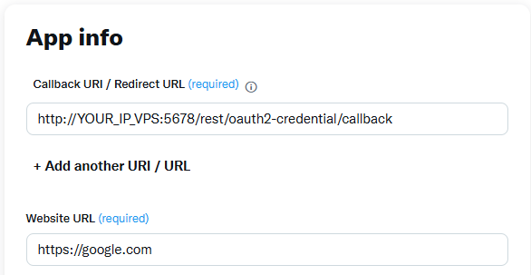
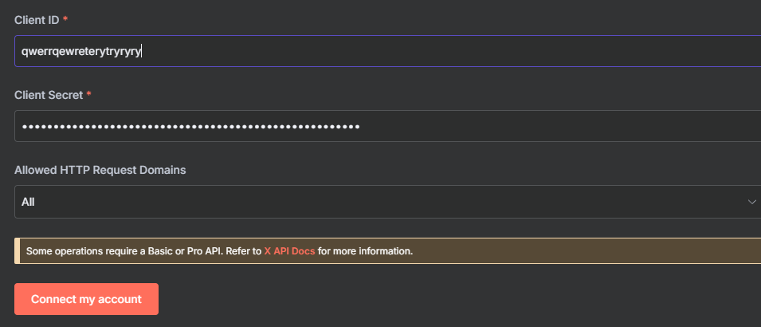
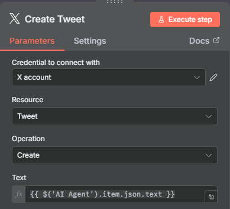

# Real-Time Tweet Automation with n8n, Membit, and Gemini

This project explains how to install n8n on a VPS and configure a workflow to automatically create tweets based on real-time trend data from Membit, using Google Gemini to generate content.

## 📋 Prerequisites

Before starting, make sure you have:
* A **VPS/Server** (Debian/Ubuntu recommended) with root access.
* A **Public IP Address** for your VPS.
* A [Google Gemini API Key](https://aistudio.google.com/api-keys)
* A [Membit API Key](https://membit.ai/integration)
* An **X (Twitter) Account** with access to the [Developer Portal](https://developer.x.com/) to create a custom application.

---

## 🚀 Part 1: Server Installation (VPS)

Log in to your VPS via SSH and set up Docker.

### 1. Install Docker
```bash
# Download the official installation script
curl -fsSL https://get.docker.com -o get-docker.sh

# Run the script
sh get-docker.sh

# Download Docker Compose binary
sudo curl -L "https://github.com/docker/compose/releases/latest/download/docker-compose-$(uname -s)-$(uname -m)" -o /usr/local/bin/docker-compose

# Grant execution permission
sudo chmod +x /usr/local/bin/docker-compose
```

---

## ⚙️ Part 2: Installing n8n with Docker Compose

### 1. Create Project Directory

```bash
# Create folder for n8n data
mkdir /root/n8n-data

# Navigate to the folder
cd /root/n8n-data
```

### 2. Create docker-compose.yml file

Create a configuration file using nano or your text editor.

```bash
nano docker-compose.yml
```

Copy and paste the entire configuration below into the file.

**IMPORTANT:** Replace `YOUR_VPS_IP` with your VPS public IP address.

```yaml
services:
  n8n:
    image: n8nio/n8n:latest
    restart: unless-stopped
    ports:
      - "5678:5678"
    environment:
      # Set your timezone
      - GENERIC_TIMEZONE=Asia/Jakarta
      
      # [FIX] Disable secure cookie to access via IP
      - N8N_SECURE_COOKIE=false
      
      # [FIX] Set webhook URL for Twitter (OAuth) connection to work
      # REPLACE "YOUR_VPS_IP" BELOW!
      - WEBHOOK_URL=http://YOUR_VPS_IP:5678/
      
    volumes:
      # Use relative path for data folder
      - ./n8n_data:/home/node/.n8n
```

Save and exit the editor (`Ctrl + X`, then `Y`, then `Enter`).

### 3. Set Permissions

This is a crucial step to prevent n8n crash-loop (Restarting).

```bash
# Create data folder manually
mkdir n8n_data

# [FIX] Grant folder ownership to 'node' user (ID 1000)
chown -R 1000:1000 n8n_data
```

### 4. Configure Firewall (UFW)

We need to open port 22 (SSH) and 5678 (n8n).

```bash
# Allow SSH (so your connection doesn't drop)
ufw allow 22/tcp

# Allow n8n port
ufw allow 5678/tcp

# Enable firewall
ufw enable
```

(Type `y` and `Enter` when prompted).

### 5. Run n8n

```bash
docker-compose up -d
```

Wait about one minute. n8n can now be accessed at `http://YOUR_VPS_IP:5678`.

---

## 🤖 Part 3: Configuring n8n Workflow

After creating an admin account in n8n, follow these steps.

### 1. Install Membit Node (MCP Client)

Access the Community Nodes page at: `http://YOUR_VPS_IP:5678/settings/community-nodes`


- Open **Settings** ⚙️ (gear icon on the left).
- Open **Community Nodes**.
- In the search box, type **MCP Client**.
- Click **Install** on `n8n-nodes-mcp-client`.

### 2. Build the Workflow


Rather than importing JSON, build the workflow manually to ensure compatibility:

- Click **+** (top right corner) to add a node.
- Add these 5 nodes to your canvas:
  - **Schedule**
  - **AI Agent**
  - **Google Gemini Chat Model**
  - **MCP Client**
  - **Create Tweet** (Twitter)

### 3. Connect Nodes

Drag arrows to create the following connections:

- **Schedule** ➔ to main input of **AI Agent**
- **Google Gemini Chat Model** ➔ to **Chat Model*** input in **AI Agent**
- **MCP Client** ➔ to **Tool** input in **AI Agent**
- **AI Agent** ➔ to main input of **Create Tweet**

---

## 🔧 Part 4: Filling Node Parameters

Click on each node to remove warning signs (🔺).

### 1. Google Gemini Chat Model

- **Credential:** Enter your Gemini API Key.
- **Host:** Leave default (`https://generativelanguage.googleapis.com`).

### 2. MCP Client

- **Endpoint:** `https://mcp.membit.ai/mcp`
- **Server Transport:** HTTP Streamable
- **Authentication:** Header Auth
- **Header Auth:**
  - **Name:** `X-Membit-Api-Key`
  - **Value:** `YOUR_API_MEMBIT`
- **Tools to Include:** All

### 3. Create Tweet

**Credential to connect with**

Click **Create New** and copy the OAuth Redirect URL:

```
http://YOUR_VPS_IP:5678/rest/oauth2-credential/callback
```

#### Go to [Developer Portal](https://developer.twitter.com/)

- Create a new app
- **App permissions:** select **Read and write**
- **Type of App:** select **Web App, Automated App or Bot**
- **App info:**



- Paste OAuth Redirect URL `http://YOUR_VPS_IP:5678/rest/oauth2-credential/callback` in **Callback URI / Redirect URL**
- **Website URL:** fill in anything
- Leave the rest blank, no problem
- Click **Save**
- **Client ID** & **Client Secret** will appear
- Copy and paste to Workflow Create Tweet



- Click **Connect my account** (X)
- Click **Save**

**Text** Enter this expression to retrieve output from AI Agent:

```
={{ $('AI Agent').item.json.output }}
```



### 4. AI Agent

- **Source for Prompt (User Message):** Change from `Connected Chat Trigger Node` to `Prompt`.
- **Prompt (User Message):** Copy and paste this prompt:

```
You are an expert social media manager. Your task is to view trend data from Membit (available as a "Tool"), select ONE most interesting topic related to 'Web3', and create an informative tweet draft in English. Make sure the tweet ends with the hashtag #Web3. Answer ONLY with the tweet draft, without any introduction.
```

- **You can customize this yourself**

---

## ▶️ Part 5: Running the Workflow

### 1. Test

Click the **"Execute workflow"** button in the top left corner to run a manual test. Check if the tweet is successfully posted.

### 2. Activation

If successful:

- Click **Save** (top right corner) to save the workflow.
- Click the **"Inactive"** toggle (next to "Save") to change it to **"Active"**.

**Done!** Your workflow will now run automatically according to the schedule in the "Schedule" node.
