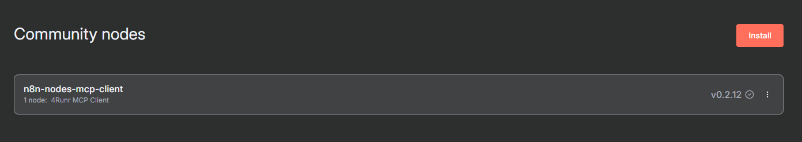
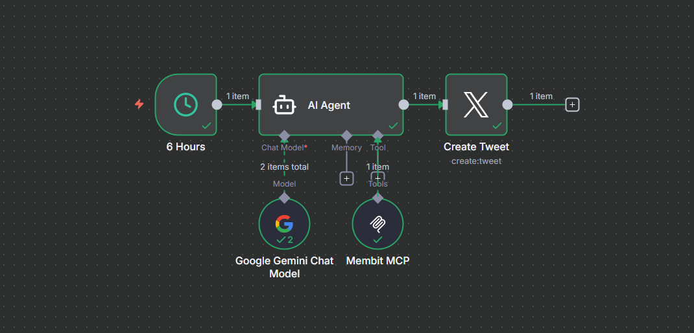

# Otomatisasi Tweet Real-Time dengan n8n, Membit, dan Gemini

Proyek ini menjelaskan cara menginstal n8n di VPS, dan mengonfigurasi alur kerja (workflow) untuk secara otomatis membuat tweet berdasarkan data tren *real-time* dari Membit, menggunakan Google Gemini untuk membuat konten.

## 📋 Prasyarat

Sebelum memulai, pastikan Anda memiliki:
* Sebuah **VPS/Server** (disarankan Debian/Ubuntu) dengan akses root.
* Alamat **IP Publik** untuk VPS Anda.
* Sebuah **API Key Google Gemini**.
* Sebuah **API Key Membit**.
* Sebuah **Akun X (Twitter)** dengan akses [Developer Portal](https://developer.x.com/) untuk membuat aplikasi kustom.

---

## 🚀 Bagian 1: Instalasi Server (VPS)

Masuk ke VPS Anda melalui SSH dan siapkan Docker.

### 1. Install Docker
```bash
# Download skrip instalasi resmi
curl -fsSL [https://get.docker.com](https://get.docker.com) -o get-docker.sh

# Jalankan skrip
sh get-docker.sh

# Download binary Docker Compose
sudo curl -L "https://github.com/docker/compose/releases/latest/download/docker-compose-$(uname -s)-$(uname -m)" -o /usr/local/bin/docker-compose

# Berikan izin eksekusi
sudo chmod +x /usr/local/bin/docker-compose
```

---

## ⚙️ Bagian 2: Instalasi n8n dengan Docker Compose

### 1. Buat Direktori Proyek

```bash

# Buat folder untuk data n8n
mkdir /root/n8n-data

# Masuk ke folder tersebut
cd /root/n8n-data
```

### 2. Buat file docker-compose.yml

Buat file konfigurasi menggunakan nano atau editor teks Anda.

```bash
nano docker-compose.yml
```

Salin dan tempelkan seluruh konfigurasi di bawah ini ke dalam file tersebut.

**PENTING:** Ganti `IP_VPS_ANDA` dengan alamat IP publik VPS Anda.

```yaml
services:
  n8n:
    image: n8nio/n8n:latest
    restart: unless-stopped
    ports:
      - "5678:5678"
    environment:
      # Atur zona waktu Anda
      - GENERIC_TIMEZONE=Asia/Jakarta
      
      # [FIX] Nonaktifkan secure cookie agar bisa diakses via IP
      - N8N_SECURE_COOKIE=false
      
      # [FIX] Atur URL webhook agar koneksi Twitter (OAuth) berhasil
      # GANTI "IP_VPS_ANDA" DI BAWAH INI!
      - WEBHOOK_URL=http://IP_VPS_ANDA:5678/
      
    volumes:
      # Gunakan path relatif untuk folder data
      - ./n8n_data:/home/node/.n8n
```

Simpan dan keluar dari editor (`Ctrl + X`, lalu `Y`, lalu `Enter`).

### 3. Atur Izin (Permissions)

Ini adalah langkah krusial untuk mencegah n8n crash-loop (Restarting).

```bash

# Buat folder data secara manual
mkdir n8n_data

# [FIX] Berikan kepemilikan folder ke user 'node' (ID 1000)
chown -R 1000:1000 n8n_data
```

### 4. Konfigurasi Firewall (UFW)

Kita harus membuka port 22 (SSH) dan 5678 (n8n).

```bash

# Izinkan SSH (agar koneksi Anda tidak terputus)
ufw allow 22/tcp

# Izinkan port n8n
ufw allow 5678/tcp

# Aktifkan firewall
ufw enable
```

(Ketik `y` dan `Enter` jika diminta).

### 5. Jalankan n8n

```bash
docker-compose up -d
```

Tunggu sekitar satu menit. n8n sekarang dapat diakses di `http://IP_VPS_ANDA:5678`.

---

## 🤖 Bagian 3: Konfigurasi Alur Kerja (Workflow) n8n

Setelah Anda membuat akun admin di n8n, ikuti langkah-langkah ini.

Akses halaman Community Nodes di: `http://YOUR_IP_VPS:5678/settings/community-nodes`



### 1. Install Node Membit (MCP Client)

- Buka **Settings** ⚙️ (ikon roda gigi di kiri).
- Buka **Community Nodes**.
- Di kotak pencarian, ketik **MCP Client**.
- Klik **Install** pada `n8n-nodes-mcp-client`.

### 2. Bangun Alur Kerja (Workflow)



Daripada mengimpor JSON, bangun alur kerja secara manual untuk memastikan kompatibilitas:

- Klik **+** (pojok kanan atas) untuk menambahkan node.
- Tambahkan 5 node ini ke kanvas Anda:
  - **Jalankan Setiap Jam** (Schedule)
  - **AI Agent**
  - **Google Gemini Chat Model**
  - **MCP Client**
  - **Create Tweet** (Twitter)

### 3. Hubungkan Node

Tarik panah untuk membuat koneksi berikut:

- **Jalankan Setiap Jam** ➔ ke input utama **AI Agent**
- **Google Gemini Chat Model** ➔ ke input **Chat Model*** di **AI Agent**
- **MCP Client** ➔ ke input **Tool** di **AI Agent**
- **AI Agent** ➔ ke input utama **Create Tweet**

---

## 🔧 Bagian 4: Mengisi Parameter Node

Klik pada setiap node untuk menghilangkan tanda peringatan (🔺).

### 1. Google Gemini Chat Model

- **Credential:** Masukkan API Key Gemini Anda.
- **Host:** Biarkan default (`https://generativelanguage.googleapis.com`).

### 2. MCP Client

- **Credential:** Masukkan API Key Membit Anda.

### 3. Create Tweet

**Credential to connect with:**

**PENTING:** Jangan gunakan X account bawaan. Klik **Create New**.

Ikuti instruksi untuk membuat Aplikasi kustom Anda sendiri di Twitter Developer Portal. Ini mengharuskan Anda memasukkan Client ID dan Client Secret dari aplikasi Anda.

**Text:** Masukkan ekspresi ini untuk mengambil output dari AI Agent:

```
={{ $('AI Agent').item.json.output }}
```

### 4. AI Agent

- **Source for Prompt (User Message):** Ubah dari `Connected Chat Trigger Node` menjadi `Prompt`.
- **Prompt (User Message):** Salin dan tempelkan prompt ini:

```
Anda adalah seorang social media manager yang ahli. Tugas Anda adalah melihat data tren dari Membit (yang tersedia sebagai "Tool"), memilih SATU topik paling menarik terkait 'Web3', dan membuat draf tweet yang informatif dalam Bahasa Indonesia. Pastikan tweet diakhiri dengan tagar #Web3. Jawab HANYA dengan draf tweet, tanpa pengantar apa pun.
```

---

## ▶️ Bagian 5: Menjalankan Alur Kerja

### 1. Uji Coba

Klik tombol **"Execute workflow"** di pojok kiri atas untuk menjalankan tes manual. Periksa apakah tweet berhasil diposting.

### 2. Aktivasi

Jika sudah berhasil:

- Klik **Save** (pojok kanan atas) untuk menyimpan alur kerja.
- Klik toggle **"Inactive"** (di sebelah "Save") untuk mengubahnya menjadi **"Active"**.

**Selesai!** Alur kerja Anda sekarang akan berjalan secara otomatis sesuai jadwal di node "Jalankan Setiap Jam".
